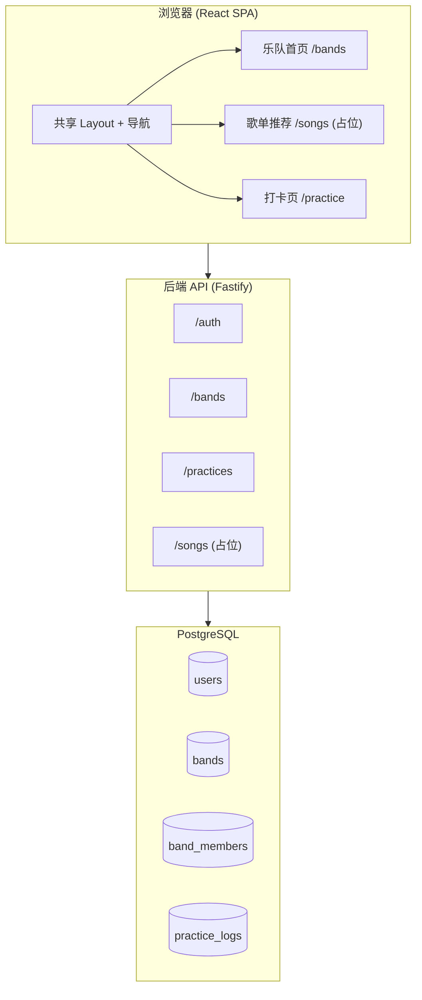

# BandMate — 新手乐队排练辅助网站 设计规格

**日期：** 2026-06-24  
**状态：** 待用户 review  
**项目目标：** 个人全栈学习项目，功能分阶段交付

---

## 1. 背景与要解决的问题

### 1.1 三个真实痛点


| #      | 问题                             | 产品应对                        |
| ------ | ------------------------------ | --------------------------- |
| ① 选歌   | 成员水平/风格不一，从零讨论选歌耗时；曲目不合适则排练效率低 | Phase 2 歌单推荐（Phase 1 占位页预告） |
| ② 排练   | 练习自发性低、无法记录，团体效率低、互相埋怨         | Phase 1 打卡页 + 团队监督面板        |
| ③ 进步模糊 | 新手不知练没练对，缺少正向反馈，易放弃            | Phase 1 问卷定级 + 可见练习记录       |


### 1.2 项目约束

- **类型：** 个人学习项目，功能可分阶段迭代
- **架构：** 前后端分离（方案 A）
- **UI 语言：** 中文
- **工作名：** BandMate（乐队伙伴）

---

## 2. 架构方案（已选定：方案 A）

### 2.1 技术栈

```
bandmate/
├── frontend/          React + Vite + TypeScript + Tailwind CSS
├── backend/           Node.js + Fastify + TypeScript + Prisma
└── docs/              设计文档与规格
```


| 层级        | 选型                              | 理由                 |
| --------- | ------------------------------- | ------------------ |
| 前端        | React 18 + Vite + TS + Tailwind | 生态大、资料多、适合学习       |
| 后端        | Fastify + TS                    | 现代、轻量、类型友好         |
| ORM       | Prisma                          | 类型安全、迁移清晰          |
| 数据库       | PostgreSQL                      | 关系型数据（用户/乐队/打卡）    |
| 认证        | JWT + httpOnly cookie           | 前后端分离常见模式          |
| 文件存储（MVP） | 本地 `backend/uploads/`           | 简单；Phase 2 换 S3/R2 |


### 2.2 系统架构图




### 2.3 本地开发

- Docker Compose 启动 PostgreSQL
- `frontend` dev server：`:5173`
- `backend` dev server：`:3000`
- CORS 允许 `http://localhost:5173`，cookie `SameSite=Lax`

---

## 3. 分阶段交付计划

### 3.1 Phase 1 — MVP（完整功能 + 占位骨架）

**完整实现：**

- 用户注册 / 登录 / 登出
- 创建乐队、邀请码加入乐队
- 成员资料：乐器 + 问卷自评 → 自动计算 skill_level (1–5)
- 打卡：练习时长、可选备注、可选音频上传
- 团队监督面板：今日各成员打卡状态、月历视图

**骨架占位（无业务逻辑，便于 Phase 2 填充）：**


| 模块                         | Phase 1 占位内容                                              | Phase 2 填充   |
| -------------------------- | --------------------------------------------------------- | ------------ |
| 歌单推荐页 `/songs`             | 页面壳、禁用态筛选 UI、「即将上线」文案                                     | 规则引擎 / AI 推荐 |
| API `GET /songs/recommend` | 返回 `{ status: "coming_soon", songs: [] }`                 | 真实推荐逻辑       |
| TypeScript 类型              | `Song`, `RecommendationRequest`, `RecommendationResponse` | 直接复用         |
| 打卡页底部                      | 灰色「即将推出：邮件提醒 · 节拍器 · 调音器」卡片                               | 逐个启用         |
| Feature 常量                 | `FEATURES.SONG_RECOMMENDATION = false`                    | 改为 `true`    |


**占位原则（避免过度设计）：**

- ✅ 路由、导航、页面壳、类型定义、空 API 路由
- ❌ 不写 mock 推荐算法、不建曲库表、不上 feature flag 框架

### 3.2 Phase 2 — 功能填充


| 功能      | 实现思路                                    |
| ------- | --------------------------------------- |
| 歌单推荐    | 本地 `songs` 表 + 规则引擎（风格 + 各乐器最低 level）   |
| AI 推荐   | 可选接 OpenAI/Claude，输入乐队 JSON → 返回推荐 + 理由 |
| 邮件提醒    | node-cron + Resend/SendGrid，每晚检查未打卡成员   |
| 反作弊     | 简化版：最低练习时长校验；完整版：WebRTC 定时截图            |
| 节拍器/调音器 | 纯前端 Web Audio API 组件                    |
| 音频自评    | 放示范音频，用户对比自评等级                          |


---

## 4. 数据模型

### 4.1 Prisma Schema（Phase 1）

```prisma
enum Instrument {
  GUITAR
  BASS
  DRUMS
  VOCALS
  OTHER
}

model User {
  id           String   @id @default(cuid())
  email        String   @unique
  passwordHash String   @map("password_hash")
  displayName  String   @map("display_name")
  createdAt    DateTime @default(now()) @map("created_at")

  bandMembers  BandMember[]
  practiceLogs PracticeLog[]

  @@map("users")
}

model Band {
  id              String   @id @default(cuid())
  name            String
  inviteCode      String   @unique @map("invite_code")
  stylePreference String?  @map("style_preference")
  createdById     String   @map("created_by_id")
  createdAt       DateTime @default(now()) @map("created_at")

  members      BandMember[]
  practiceLogs PracticeLog[]

  @@map("bands")
}

model BandMember {
  id                   String     @id @default(cuid())
  bandId               String     @map("band_id")
  userId               String     @map("user_id")
  instrument           Instrument
  skillLevel           Int        @default(1) @map("skill_level") // 1-5
  questionnaireAnswers Json?      @map("questionnaire_answers")
  joinedAt             DateTime   @default(now()) @map("joined_at")

  band Band @relation(fields: [bandId], references: [id], onDelete: Cascade)
  user User @relation(fields: [userId], references: [id], onDelete: Cascade)

  @@unique([bandId, userId])
  @@map("band_members")
}

model PracticeLog {
  id              String   @id @default(cuid())
  bandId          String   @map("band_id")
  userId          String   @map("user_id")
  date            DateTime @db.Date
  durationMinutes Int      @map("duration_minutes")
  note            String?
  audioUrl        String?  @map("audio_url")
  createdAt       DateTime @default(now()) @map("created_at")

  band Band @relation(fields: [bandId], references: [id], onDelete: Cascade)
  user User @relation(fields: [userId], references: [id], onDelete: Cascade)

  @@unique([bandId, userId, date])
  @@map("practice_logs")
}
```

### 4.2 等级问卷结构

问卷答案存于 `questionnaireAnswers` JSON 字段，后端 `skillAssessment.ts` 计算 `skillLevel`。

**通用字段：**

- `weeklyPracticeHours`: `"<1"` | `"1-3"` | `"3-5"` | `"5+"`
- `stylePreference`: `"rock"` | `"pop"` | `"folk"` | `"metal"` | `"any"`

**按乐器追加题目（示例）：**


| 乐器  | 题目                  | 权重    |
| --- | ------------------- | ----- |
| 吉他  | 开放和弦 / 横按 / 简单 solo | 各 1 分 |
| 贝斯  | 根音跟弹 / 简单加花         | 各 1 分 |
| 鼓   | 基本节奏型 / 双踩或复合节奏     | 各 1 分 |
| 主唱  | 跟调 / 真假声切换          | 各 1 分 |


**等级映射：** 总分 → 1（入门）~ 5（进阶），具体阈值在实现时于 `skillAssessment.ts` 定义。

---

## 5. API 设计

### 5.1 认证


| 方法   | 路径               | 说明                                 |
| ---- | ---------------- | ---------------------------------- |
| POST | `/auth/register` | `{ email, password, displayName }` |
| POST | `/auth/login`    | `{ email, password }` → Set-Cookie |
| POST | `/auth/logout`   | 清除 Cookie                          |
| GET  | `/auth/me`       | 当前用户信息                             |


### 5.2 乐队


| 方法   | 路径                      | 说明                                                |
| ---- | ----------------------- | ------------------------------------------------- |
| POST | `/bands`                | 创建乐队 `{ name, stylePreference? }` → 返回 inviteCode |
| POST | `/bands/join`           | `{ inviteCode }` 加入乐队                             |
| GET  | `/bands/:id`            | 乐队详情 + 成员列表                                       |
| PUT  | `/bands/:id/members/me` | 更新乐器、问卷答案、skillLevel                              |


### 5.3 打卡


| 方法   | 路径                          | 说明                                                |
| ---- | --------------------------- | ------------------------------------------------- |
| POST | `/practices`                | `{ bandId, durationMinutes, note?, audio? }` 今日打卡 |
| GET  | `/practices?bandId=&month=` | 某乐队某月全部打卡（YYYY-MM）                                |
| GET  | `/practices/today?bandId=`  | 今日各成员打卡状态                                         |


**音频上传：** `POST /practices` 使用 `multipart/form-data`，MVP 限制 mp3/wav、最大 10MB。

### 5.4 歌单（占位）


| 方法  | 路径                         | Phase 1 响应                                               | Phase 2 |
| --- | -------------------------- | -------------------------------------------------------- | ------- |
| GET | `/songs/recommend?bandId=` | `{ status: "coming_soon", songs: [], message: "功能开发中" }` | 真实推荐列表  |


### 5.5 错误格式

```json
{
  "error": {
    "code": "VALIDATION_ERROR",
    "message": "人类可读描述"
  }
}
```

常见 HTTP 状态：`400` 校验失败、`401` 未登录、`403` 非乐队成员、`404` 资源不存在、`409` 重复打卡。

---

## 6. 前端设计

### 6.1 路由


| 路径             | 页面        | Phase 1 状态 |
| -------------- | --------- | ---------- |
| `/login`       | 登录        | 完整         |
| `/register`    | 注册        | 完整         |
| `/` 或 `/bands` | 乐队首页      | 完整         |
| `/songs`       | 歌单推荐      | **占位壳**    |
| `/practice`    | 打卡 / 监督面板 | 完整         |


未登录访问受保护路由 → 重定向 `/login`。

### 6.2 共享 Layout

```
┌──────────────────────────────────────────────┐
│  BandMate          [乐队] [歌单] [打卡]  👤  │
├──────────────────────────────────────────────┤
│                                              │
│              {页面内容}                       │
│                                              │
└──────────────────────────────────────────────┘
```

- 三个 Tab 始终可见；`/songs` Tab 可带 small badge「即将上线」
- 当前 Tab 高亮；无乐队时 `/songs` 和 `/practice` 显示「请先加入乐队」

### 6.3 乐队首页

**状态 A — 未登录：** 跳转登录/注册

**状态 B — 已登录、无乐队：**

- 「创建乐队」表单（名称、风格偏好）
- 「输入邀请码加入」

**状态 C — 已有乐队：**

- 乐队名、风格、邀请码（一键复制）
- 成员卡片网格：昵称、乐器图标、等级（1–5 星）
- 「完善我的资料」→ 问卷 Modal
- 快捷入口：「去打卡」

### 6.4 歌单推荐页（占位）

```
┌─────────────────────────────────────┐
│  🎵 歌单推荐          [即将上线]    │
├─────────────────────────────────────┤
│  根据乐队成员水平和风格偏好，        │
│  智能推荐适合排练的歌曲。            │
│                                     │
│  风格 [摇滚 ▼]  难度 [全部 ▼]       │  ← disabled
│                                     │
│  ┌─────────────────────────────┐   │
│  │   暂无推荐 — 功能开发中      │   │
│  └─────────────────────────────┘   │
└─────────────────────────────────────┘
```

组件挂载时可调用 `GET /songs/recommend` 验证 API 连通；展示 `message` 字段。

### 6.5 打卡页

**顶部：** 乐队名 + 月历（有打卡日期高亮）

**今日打卡区（自己）：**

- 练习时长（分钟，必填，最小 1）
- 备注（可选）
- 音频上传（可选，mp3/wav ≤ 10MB）
- 「提交打卡」

**团队面板：**

- 成员列表：头像/昵称、今日状态（✅ 已练 X 分钟 / ⏳ 未练）
- 减少信息不透明导致的互相埋怨

**底部占位卡片：**

> 即将推出：练习邮件提醒 · 内置节拍器 · 调音器

**历史：** 点击日历某天 → 侧边/弹层展示该日各成员记录

### 6.6 目录结构

```
frontend/src/
├── pages/
│   ├── Login.tsx
│   ├── Register.tsx
│   ├── BandHome.tsx
│   ├── SongRecommend.tsx      # 占位页
│   └── Practice.tsx
├── components/
│   ├── layout/
│   │   ├── AppLayout.tsx
│   │   └── NavBar.tsx
│   ├── band/
│   │   ├── MemberCard.tsx
│   │   ├── CreateBandForm.tsx
│   │   └── JoinBandForm.tsx
│   ├── practice/
│   │   ├── PracticeCalendar.tsx
│   │   ├── CheckInForm.tsx
│   │   └── TeamStatusPanel.tsx
│   └── shared/
│       └── SkillQuestionnaire.tsx
├── hooks/
│   ├── useAuth.ts
│   └── useBand.ts
├── api/
│   ├── client.ts
│   ├── auth.ts
│   ├── bands.ts
│   ├── practices.ts
│   └── songs.ts               # 占位 API 客户端
├── types/
│   ├── band.ts
│   ├── practice.ts
│   └── song.ts                # Phase 2 复用
├── config/
│   └── features.ts            # FEATURES 常量
└── App.tsx
```

---

## 7. 后端设计

### 7.1 目录结构

```
backend/src/
├── index.ts
├── routes/
│   ├── auth.ts
│   ├── bands.ts
│   ├── practices.ts
│   └── songs.ts               # 占位路由
├── services/
│   ├── authService.ts
│   ├── bandService.ts
│   ├── practiceService.ts
│   └── skillAssessment.ts
├── middleware/
│   └── authenticate.ts
├── config/
│   └── features.ts
└── prisma/
    └── schema.prisma
```

### 7.2 业务规则

- 每个用户同一时间只属于一个乐队（MVP 简化；Phase 2 可改多乐队）
- 同一用户同一乐队同一天只能打卡一次（`409` 若重复）
- 只有乐队成员可查看该乐队打卡数据
- 创建乐队时自动生成 8 位 inviteCode
- 加入乐队后必须完成问卷才能出现在成员列表（或显示「资料未完善」）

---

## 8. 共享 TypeScript 类型（Phase 2 预留）

```typescript
// types/song.ts — 前后端各自维护相同定义，Phase 2 可抽 shared 包

export interface Song {
  id: string;
  title: string;
  artist: string;
  style: string;
  minSkillLevel: Record<Instrument, number>;
  bpm?: number;
}

export interface RecommendationResponse {
  status: 'coming_soon' | 'ok';
  songs: Song[];
  message?: string;
}
```

---

## 9. 非功能需求


| 项   | MVP 要求                                |
| --- | ------------------------------------- |
| 安全  | 密码 bcrypt；JWT 短期有效 + httpOnly cookie  |
| 校验  | 前后端双重校验必填字段                           |
| 部署  | 本地 Docker Compose；可选 Railway + Vercel |
| 测试  | 核心 API 集成测试（auth、bands、practices）     |
| 日志  | Fastify 内置 logger，开发环境 pretty print   |


---

## 10. 验收标准（Phase 1 Done）

- [ ] 用户可注册、登录、登出
- [ ] 用户可创建乐队并通过邀请码邀请成员加入
- [ ] 成员可填写问卷并获得 1–5 等级
- [ ] 成员可提交今日打卡（时长 + 可选音频）
- [ ] 团队面板显示今日各成员打卡状态
- [ ] 月历可查看历史打卡
- [ ] 三个 Tab 导航可用；歌单页显示占位 UI
- [ ] `GET /songs/recommend` 返回 coming_soon 结构
- [ ] 本地 Docker Compose 一键启动数据库

---

## 11. 不在 Phase 1 范围内

- 歌单推荐算法 / AI / 曲库
- 邮件提醒
- 反作弊截图
- 节拍器 / 调音器
- 音频示范自评
- 多乐队支持
- 云存储（S3/R2）
- 生产级监控

---

## Spec 自检（2026-06-24）


| 检查项       | 结果                                     |
| --------- | -------------------------------------- |
| 占位符 / TBD | 无；等级阈值在实现文件定义，已说明                      |
| 内部一致性     | 架构、API、页面、Phase 划分一致                   |
| 范围        | 单 spec 覆盖 Phase 1 + Phase 2 预览，可一次实现计划 |
| 歧义        | 每用户单乐队 MVP 已明确；重复打卡返回 409 已明确          |


