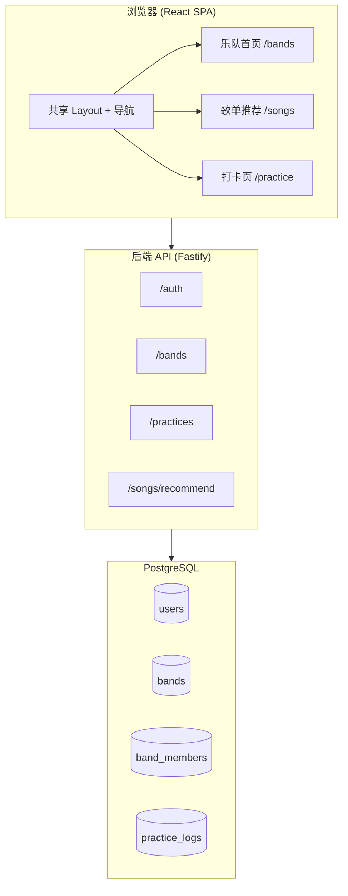

# BandMate — 新手乐队排练辅助网站 设计规格

**日期：** 2026-06-24  
**状态：** Phase 1 + Phase 2（歌单推荐）已落地；本文档保留原始设计，**以 §「实现状态」为准**  
**项目目标：** 个人全栈学习项目，功能分阶段交付

---

## 实现状态（2026-06-26，对齐代码）

> 代码仓库已超出下文部分章节的「占位 / 单乐队」描述。改功能前先看 [README.md](../../README.md) 与本节。

### 已交付（Phase 1）

| 能力 | 说明 |
|------|------|
| 认证 | 注册 / 登录 / httpOnly JWT；设置页改昵称、密码、主题 |
| 乐队 | **多乐队**；邀请码 / `/join?code=`；编辑队名与 `stylePreferences[]`；退出乐队 |
| 成员资料 | 问卷 → skill 1–5；**按乐队保存**（加入时复制已有资料，编辑仅影响当前乐队） |
| 打卡 | 每日每乐队一次；备注 + 音频；个人 streak / 周统计；团队今日面板 + 月历 |
| 练习工具 | **节拍器、调音器**（练习页侧栏 / 手机底栏）— 已上线，非占位 |

### 已交付（Phase 2）

| 能力 | 说明 |
|------|------|
| 曲库 | `backend/data/songs.seed.json` **500 首** v2（编制 / 分声部 / fallbacks），非 Prisma 表 |
| 推荐 | 规则引擎筛选 + 排序；`stretch` / `styleStretch`；空结果 `hints` 诊断 |
| AI | 可选 `LLM_*`（智谱等）；**仅生成推荐语**，不选曲；`useAi` 查询参数 |
| 前端 | `/songs` 推荐卡片；`FEATURES.SONG_RECOMMENDATION` 前后端均为 `true` |

### 计划中（尚未实现）

- 练习邮件提醒  
- 乐队排练歌单 / 投票  
- 反作弊、音频自评、云存储（S3/R2）

### 与下文原稿的主要差异

| 原稿 | 当前实现 |
|------|----------|
| 每用户单乐队 | 多乐队 + `GET /bands/me` → `{ bands, band }` |
| `stylePreference` 单选 | `stylePreferences` 多选 JSON 数组 |
| 无 `KEYBOARD` | `Instrument.KEYBOARD` 已加入 |
| 歌单占位 / `coming_soon` | 完整推荐 API + UI（flag 关闭时仍可回退 `coming_soon`） |
| 曲库 65 首 / Prisma Song | 500 首 JSON seed |
| OpenAI 选曲 | 规则引擎选曲 + LLM 写理由 |

---

## 1. 背景与要解决的问题

### 1.1 三个真实痛点


| #      | 问题                             | 产品应对                        |
| ------ | ------------------------------ | --------------------------- |
| ① 选歌   | 成员水平/风格不一，从零讨论选歌耗时；曲目不合适则排练效率低 | Phase 2 歌单推荐（规则引擎 + 可选 AI，500 首曲库） |
| ② 排练   | 练习自发性低、无法记录，团体效率低、互相埋怨         | Phase 1 打卡页 + 团队监督面板 + 节拍器/调音器 |
| ③ 进步模糊 | 新手不知练没练对，缺少正向反馈，易放弃            | Phase 1 问卷定级 + 可见练习记录       |


### 1.2 项目约束

- **类型：** 个人学习项目，功能可分阶段迭代
- **架构：** 前后端分离（方案 A）
- **UI 语言：** 中文
- **工作名：** BandMate（乐队伙伴）

---

## 2. 架构方案（已选定：方案 A）

### 2.1 技术栈

```
bandmate/
├── frontend/          React + Vite + TypeScript + Tailwind CSS
├── backend/           Node.js + Fastify + TypeScript + Prisma
└── docs/              设计文档与规格
```


| 层级        | 选型                              | 理由                 |
| --------- | ------------------------------- | ------------------ |
| 前端        | React 18 + Vite + TS + Tailwind | 生态大、资料多、适合学习       |
| 后端        | Fastify + TS                    | 现代、轻量、类型友好         |
| ORM       | Prisma                          | 类型安全、迁移清晰          |
| 数据库       | PostgreSQL                      | 关系型数据（用户/乐队/打卡）    |
| 认证        | JWT + httpOnly cookie           | 前后端分离常见模式          |
| 文件存储（MVP） | 本地 `backend/uploads/`           | 简单；Phase 2 换 S3/R2 |


### 2.2 系统架构图




### 2.3 本地开发

- Docker Compose 启动 PostgreSQL
- `frontend` dev server：`:5173`
- `backend` dev server：`:3000`
- CORS 允许 `http://localhost:5173`，cookie `SameSite=Lax`

---

## 3. 分阶段交付计划

### 3.1 Phase 1 — MVP（**已实现**，2026-06）

**完整实现：**

- 用户注册 / 登录 / 登出；设置页（昵称、密码、主题）
- 创建乐队、邀请码 / 链接加入；**支持多乐队**
- 成员资料：乐器 + 问卷 → skill_level (1–5)，按乐队独立保存
- 打卡：练习时长、备注、音频；个人统计 + 团队监督 + 月历
- 节拍器 / 调音器（练习页工具栏）

**原 Phase 1 占位项（已由 Phase 2 替换）：**

| 模块 | 原占位 | 当前状态 |
|------|--------|----------|
| `/songs` | 壳 +「即将上线」 | **已上线** 规则推荐 + 可选 AI 文案 |
| `GET /songs/recommend` | `coming_soon` | `ok` / `empty` / `coming_soon`（feature flag） |
| `FEATURES.SONG_RECOMMENDATION` | `false` | **`true`**（前后端 `config/features.ts`） |

### 3.2 Phase 2 — 功能填充（**部分已实现**）

| 功能 | 状态 | 实现说明 |
|------|------|----------|
| 歌单推荐 | ✅ | JSON seed 500 首 + `recommendationRuleEngine` + `recommendationService` |
| AI 推荐语 | ✅ | `LLM_*` 环境变量；规则先选曲，AI 只写理由 |
| 节拍器/调音器 | ✅ | 归入练习页（实现早于文档更新） |
| 邮件提醒 | ⏳ | 未实现 |
| 反作弊 / 音频自评 | ⏳ | 未实现 |


---

## 4. 数据模型

### 4.1 Prisma Schema（Phase 1）

```prisma
enum Instrument {
  GUITAR
  BASS
  DRUMS
  VOCALS
  OTHER
}

model User {
  id           String   @id @default(cuid())
  email        String   @unique
  passwordHash String   @map("password_hash")
  displayName  String   @map("display_name")
  createdAt    DateTime @default(now()) @map("created_at")

  bandMembers  BandMember[]
  practiceLogs PracticeLog[]

  @@map("users")
}

model Band {
  id              String   @id @default(cuid())
  name            String
  inviteCode      String   @unique @map("invite_code")
  stylePreference String?  @map("style_preference")
  createdById     String   @map("created_by_id")
  createdAt       DateTime @default(now()) @map("created_at")

  members      BandMember[]
  practiceLogs PracticeLog[]

  @@map("bands")
}

model BandMember {
  id                   String     @id @default(cuid())
  bandId               String     @map("band_id")
  userId               String     @map("user_id")
  instrument           Instrument
  skillLevel           Int        @default(1) @map("skill_level") // 1-5
  questionnaireAnswers Json?      @map("questionnaire_answers")
  joinedAt             DateTime   @default(now()) @map("joined_at")

  band Band @relation(fields: [bandId], references: [id], onDelete: Cascade)
  user User @relation(fields: [userId], references: [id], onDelete: Cascade)

  @@unique([bandId, userId])
  @@map("band_members")
}

model PracticeLog {
  id              String   @id @default(cuid())
  bandId          String   @map("band_id")
  userId          String   @map("user_id")
  date            DateTime @db.Date
  durationMinutes Int      @map("duration_minutes")
  note            String?
  audioUrl        String?  @map("audio_url")
  createdAt       DateTime @default(now()) @map("created_at")

  band Band @relation(fields: [bandId], references: [id], onDelete: Cascade)
  user User @relation(fields: [userId], references: [id], onDelete: Cascade)

  @@unique([bandId, userId, date])
  @@map("practice_logs")
}
```

### 4.2 等级问卷结构

问卷答案存于 `questionnaireAnswers` JSON 字段，后端 `skillAssessment.ts` 计算 `skillLevel`。

**通用字段：**

- `weeklyPracticeHours`: `"<1"` | `"1-3"` | `"3-5"` | `"5+"`
- `stylePreference`: `"rock"` | `"pop"` | `"folk"` | `"metal"` | `"any"`

**按乐器追加题目（示例）：**


| 乐器  | 题目                  | 权重    |
| --- | ------------------- | ----- |
| 吉他  | 开放和弦 / 横按 / 简单 solo | 各 1 分 |
| 贝斯  | 根音跟弹 / 简单加花         | 各 1 分 |
| 鼓   | 基本节奏型 / 双踩或复合节奏     | 各 1 分 |
| 主唱  | 跟调 / 真假声切换          | 各 1 分 |


**等级映射：** 总分 → 1（入门）~ 5（进阶），具体阈值在实现时于 `skillAssessment.ts` 定义。

---

## 5. API 设计

### 5.1 认证


| 方法   | 路径               | 说明                                 |
| ---- | ---------------- | ---------------------------------- |
| POST | `/auth/register` | `{ email, password, displayName }` |
| POST | `/auth/login`    | `{ email, password }` → Set-Cookie |
| POST | `/auth/logout`   | 清除 Cookie                          |
| GET  | `/auth/me`       | 当前用户信息                             |


### 5.2 乐队


| 方法   | 路径                      | 说明                                                |
| ---- | ----------------------- | ------------------------------------------------- |
| POST | `/bands`                | 创建乐队 `{ name, stylePreference? }` → 返回 inviteCode |
| POST | `/bands/join`           | `{ inviteCode }` 加入乐队                             |
| GET  | `/bands/:id`            | 乐队详情 + 成员列表                                       |
| PUT  | `/bands/:id/members/me` | 更新乐器、问卷答案、skillLevel                              |


### 5.3 打卡


| 方法   | 路径                          | 说明                                                |
| ---- | --------------------------- | ------------------------------------------------- |
| POST | `/practices`                | `{ bandId, durationMinutes, note?, audio? }` 今日打卡 |
| GET  | `/practices?bandId=&month=` | 某乐队某月全部打卡（YYYY-MM）                                |
| GET  | `/practices/today?bandId=`  | 今日各成员打卡状态                                         |


**音频上传：** `POST /practices` 使用 `multipart/form-data`，MVP 限制 mp3/wav、最大 10MB。

### 5.4 歌单推荐（Phase 2 — 已实现）

`GET /songs/recommend?bandId=&useAi=true|false`

| status | 含义 |
|--------|------|
| `ok` | 有推荐列表（最多 6 首展示） |
| `empty` | 无匹配，`hints[]` 诊断建议 |
| `coming_soon` | `FEATURES.SONG_RECOMMENDATION === false` |

响应含 `RecommendedSong`（含 `stretchHints`、`isStretch`、`isStyleStretch`、`listenUrl` 等）及可选 `aiAvailable` / `aiUsed`。


### 5.5 错误格式

```json
{
  "error": {
    "code": "VALIDATION_ERROR",
    "message": "人类可读描述"
  }
}
```

常见 HTTP 状态：`400` 校验失败、`401` 未登录、`403` 非乐队成员、`404` 资源不存在、`409` 重复打卡。

---

## 6. 前端设计

### 6.1 路由


| 路径             | 页面        | 状态 |
| -------------- | --------- | ---- |
| `/login`       | 登录        | ✅ |
| `/register`    | 注册        | ✅ |
| `/join`        | 邀请深链加入    | ✅ |
| `/`            | 乐队首页（多乐队） | ✅ |
| `/songs`       | 歌单推荐      | ✅ |
| `/practice`    | 打卡 / 监督面板 | ✅ |
| `/settings`    | 账户设置      | ✅ |


未登录访问受保护路由 → 重定向 `/login`。

### 6.2 共享 Layout

```
┌──────────────────────────────────────────────┐
│  BandMate          [乐队] [歌单] [打卡]  👤  │
├──────────────────────────────────────────────┤
│                                              │
│              {页面内容}                       │
│                                              │
└──────────────────────────────────────────────┘
```

- 三个 Tab 始终可见（歌单无「即将上线」角标）
- 无乐队时 `/songs` 和 `/practice` 显示统一空状态 + 跳转首页 CTA

### 6.3 乐队首页

**状态 A — 未登录：** 跳转登录/注册

**状态 B — 已登录、无乐队：**

- 「创建乐队」表单（名称、风格偏好）
- 「输入邀请码加入」

**状态 C — 已有乐队：**

- 乐队名、风格、邀请码（一键复制）
- 成员卡片网格：昵称、乐器图标、等级（1–5 星）
- 「完善我的资料」→ 问卷 Modal
- 快捷入口：「去打卡」

### 6.4 歌单推荐页（已实现）

- 乐队选择器（多乐队时）
- 推荐卡片：编制 / 难度 / 偏难·风格略偏角标 / 网易云搜索链接
- 可选「使用 AI 推荐语」（需服务端 `LLM_API_KEY`）
- 空结果展示 `hints` 与完善资料引导

### 6.5 打卡页

**顶部：** 乐队名 + 月历（有打卡日期高亮）

**今日打卡区（自己）：**

- 练习时长（分钟，必填，最小 1）
- 备注（可选）
- 音频上传（可选，mp3/wav ≤ 10MB）
- 「提交打卡」

**团队面板：**

- 成员列表：头像/昵称、今日状态（✅ 已练 X 分钟 / ⏳ 未练）
- 减少信息不透明导致的互相埋怨

**底部卡片：**

> 练习工具：节拍器与调音器见页面侧栏 / 底部按钮。  
> **即将推出：** 练习邮件提醒。

**历史：** 点击日历某天 → 侧边/弹层展示该日各成员记录

### 6.6 目录结构

```
frontend/src/
├── pages/
│   ├── Login.tsx
│   ├── Register.tsx
│   ├── BandHome.tsx
│   ├── SongRecommend.tsx      # 歌单推荐
│   ├── Practice.tsx
│   └── Settings.tsx
├── components/
│   ├── layout/
│   │   ├── AppLayout.tsx
│   │   └── NavBar.tsx
│   ├── band/
│   │   ├── MemberCard.tsx
│   │   ├── CreateBandForm.tsx
│   │   └── JoinBandForm.tsx
│   ├── practice/
│   │   ├── PracticeCalendar.tsx
│   │   ├── CheckInForm.tsx
│   │   └── TeamStatusPanel.tsx
│   └── shared/
│       └── SkillQuestionnaire.tsx
├── hooks/
│   ├── useAuth.ts
│   └── useBand.ts
├── api/
│   ├── client.ts
│   ├── auth.ts
│   ├── bands.ts
│   ├── practices.ts
│   └── songs.ts
├── types/
│   ├── band.ts
│   ├── practice.ts
│   └── song.ts                # Phase 2 复用
├── config/
│   └── features.ts            # FEATURES 常量
└── App.tsx
```

---

## 7. 后端设计

### 7.1 目录结构

```
backend/src/
├── index.ts
├── routes/
│   ├── auth.ts
│   ├── bands.ts
│   ├── practices.ts
│   └── songs.ts               # GET /songs/recommend
├── services/
│   ├── authService.ts
│   ├── bandService.ts
│   ├── practiceService.ts
│   ├── skillAssessment.ts
│   ├── recommendationService.ts
│   └── recommendationRuleEngine.ts
├── middleware/
│   └── authenticate.ts
├── config/
│   └── features.ts
└── prisma/
    └── schema.prisma
```

### 7.2 业务规则

- 用户可加入**多个乐队**；打卡、资料、推荐按 `bandId` 区分
- 同一用户同一乐队同一天只能打卡一次（`409` 若重复）
- 只有乐队成员可查看该乐队打卡数据
- 创建乐队时自动生成 8 位 hex `inviteCode`（粘贴时容忍空格/横线）
- 加入新乐队时复制已有问卷资料；**按乐队编辑资料互不影响**
- 资料未完善时成员可显示「资料未完善」

---

## 8. 共享 TypeScript 类型（Phase 2 预留）

```typescript
// types/song.ts — 前后端各自维护相同定义，Phase 2 可抽 shared 包

export interface Song {
  id: string;
  title: string;
  artist: string;
  style: string;
  minSkillLevel: Record<Instrument, number>;
  bpm?: number;
}

export interface RecommendationResponse {
  status: 'coming_soon' | 'ok';
  songs: Song[];
  message?: string;
}
```

---

## 9. 非功能需求


| 项   | MVP 要求                                |
| --- | ------------------------------------- |
| 安全  | 密码 bcrypt；JWT 短期有效 + httpOnly cookie  |
| 校验  | 前后端双重校验必填字段                           |
| 部署  | 本地 Docker Compose；可选 Railway + Vercel |
| 测试  | 核心 API 集成测试（auth、bands、practices）     |
| 日志  | Fastify 内置 logger，开发环境 pretty print   |


---

## 10. 验收标准

### Phase 1 — Done ✅

- [x] 用户可注册、登录、登出
- [x] 用户可创建乐队并通过邀请码邀请成员加入
- [x] 成员可填写问卷并获得 1–5 等级
- [x] 成员可提交今日打卡（时长 + 可选音频）
- [x] 团队面板显示今日各成员打卡状态
- [x] 月历可查看历史打卡
- [x] 三个 Tab 导航可用
- [x] 本地 Docker Compose 一键启动数据库

### Phase 2 歌单 — Done ✅

- [x] `GET /songs/recommend` 返回真实推荐（非占位）
- [x] 500 首 v2 seed + 规则引擎 + 可选 AI 文案
- [x] 前端推荐卡片与空状态诊断

---

## 11. 尚未实现 / 后续阶段

- 邮件提醒
- 反作弊截图
- 音频示范自评
- 云存储（S3/R2）
- 乐队排练歌单 / 投票
- 生产级监控

**说明：** 歌单推荐、节拍器/调音器、多乐队支持已从「不在 Phase 1」移至已交付（见文首「实现状态」）。

---

## Spec 自检（2026-06-26）


| 检查项       | 结果                                     |
| --------- | -------------------------------------- |
| 与代码一致     | 文首「实现状态」覆盖占位/单乐队等过时描述；细节以 README 为准 |
| 内部一致性     | §3 分阶段表已与实现对齐 |
| 范围        | 历史章节保留作设计脉络；新功能先更新「实现状态」 |


